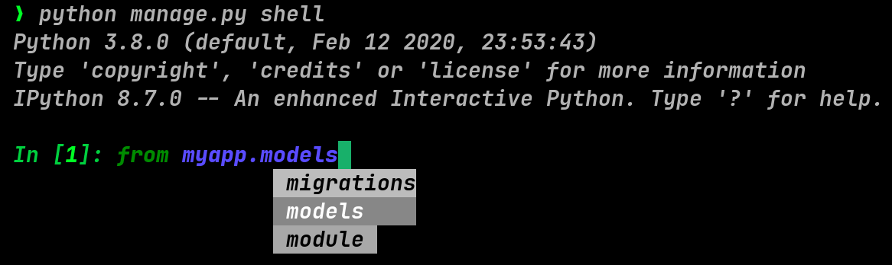
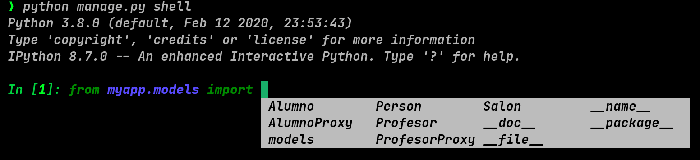
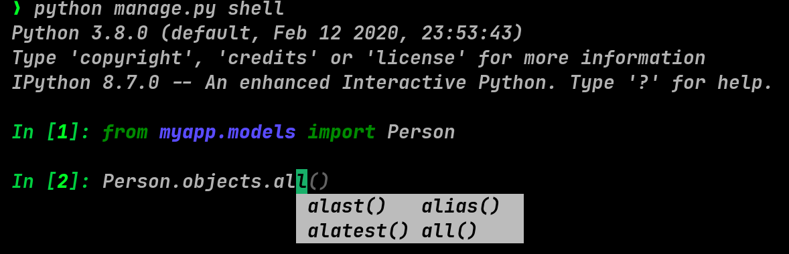
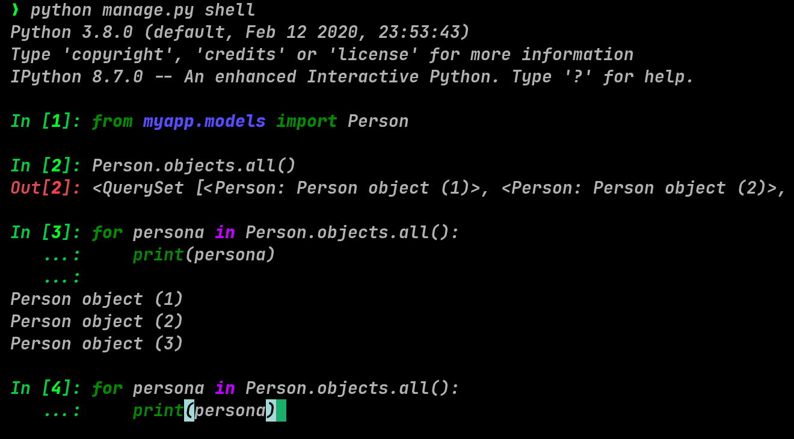

# Django shell

Ejecutar a través del siguiente comando: (tener en cuenta la ubicación
desde donde lo invocaremos)

``` shell
python manage.py shell
```

Nos será de utilidad al tener modelos listos.

## Recordando

Tenemos la siguiente estructura del proyecto:

``` example
.
├── db.sqlite3
├── manage.py
├── myapp
│   ├── __init__.py
│   ├── __pycache__/
│   ├── admin.py
│   ├── apps.py
│   ├── migrations/
│   ├── models.py
│   ├── tests.py
│   └── views.py
└── mysite
    ├── __init__.py
    ├── __pycache__/
    ├── asgi.py
    ├── settings.py
    ├── urls.py
    └── wsgi.py
```

## Crear un registro desde la shell

Si ya hemos creado un modelo, podemos crear un registro desde la shell

*Estamos usando el modelo que creamos dentro de `myapp`*

- Crear un registro

```bash
from myapp.models import Person

person = Person(name='Juan', description='Estudiante')
person.save()
```

- Lista los registros

```bash
Person.objects.all()
```

- Obtener por un campo

```bash
Person.objects.get(pk=1)
Person.objects.get(name='Juan')
```

Nota: Recordar siempre importar el modelo que se desea utilizar.

## Uso opcional de ipython

Podemos usar [ipython](https://ipython.org/) para mejorar nuestra experiencia (de una manera más interactiva) de la shell con los modelos de `django`.

Instalando `ipython` en nuestro entorno virtual:

```bash
pip install ipython
```

La siguiente vez que ejecutamos la `shell` se activará `ipython`
(tener en cuenta la estructura de tu proyecto y la ubicación desde donde hacemos la invocación)

``` shell
python manage.py shell
```

Es importante tener en cuenta la estructura de nuestro proyecto para que podamos importar con facilidad nuestros modelos.

``` example
.
├── myapp
│   ├── migrations
│   │   ├── 0001_initial.py
│   │   └── __init__.py
│   ├── __init__.py
│   ├── admin.py
│   ├── apps.py
│   ├── models.py
│   ├── tests.py
│   └── views.py
├── db.sqlite3
├── manage.py
└── mysite
    ├── __init__.py
    ├── asgi.py
    ├── settings.py
    ├── urls.py
    └── wsgi.py
```

Ahora la shell invocada lucirá de esta forma:


Podemos observar que:

- Aparecen colores y se resalta los inputs (como **In[1]**) y outputs.
- Tenemos acceso a autocompletado.

Con el autocompletado podremos invocar las clases que se han definido:



Asimismo podemos invocar los métodos disponibles:



Un punto interesante a recalcar es que cuando hacemos flecha arriba en la shell de `ipython` nos permite invocar un bucle y no solo la última línea como pasaría en la shell por defecto:



Finalmente comentar que ipython mejora la experiencia de interacción pero no reemplaza a un editor o IDE. El objetivo es facilitar la experimentación.